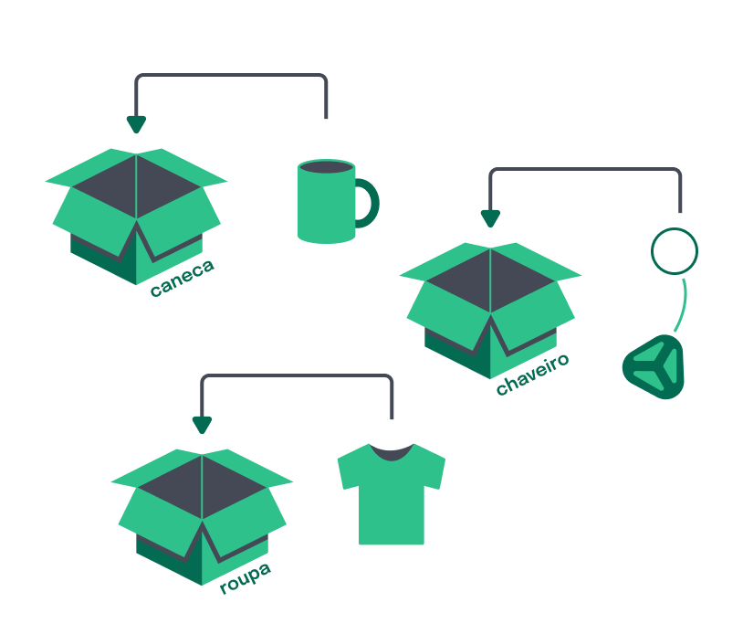
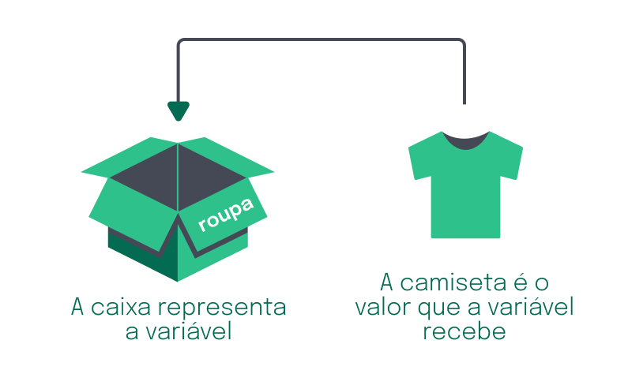
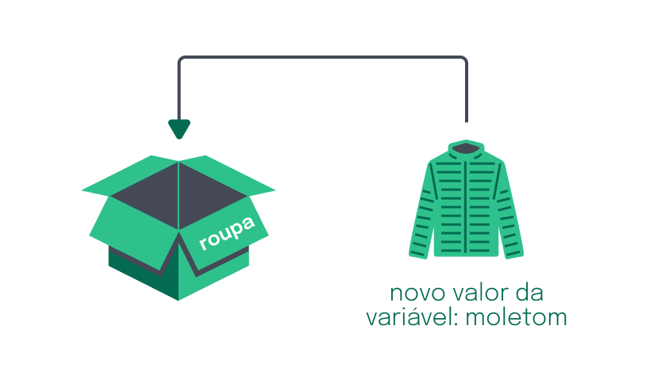

# Variáveis e Constantes

# O que vamos aprender?

  * Vamos aprender a escrever nossas primeiras linhas de código em _Javascript_, criando e armazenando valores em variáveis! Vamos compreender o que são variáveis, seus diferentes tipos e ainda entender e manipular dados.

## Seremos capaz de:

  * Criar variáveis;
  * Entender a estrutura de uma variável;
  * Atribuir valores às variáveis.

# Por que isso é importante?

  * O conceito de variáveis está entre os conceitos mais importantes ao escrever código para programas. Variáveis são como caixas que guardam informações na memória do computador e que podem ser utilizadas em todas as partes do programa.

  * Provavelmente interagimos com sistemas que guardam informações nessas caixas:

    * O nome do usuário, quando faz o login no computador;
    * O número da conta, quando o sistema de um banco é acessado;
    * Uma mensagem enviada, por um aplicativo, podem ser encontradas guardadas em variáveis.

  * Entre essas e outras situações, as variáveis estão presentes no nosso dia a dia e nem percebemos!

# O que são variáveis?

  * Variáveis são espaços na memória do computador, que funcionam como caixas que possuem um nome e que podemos guardar alguma coisa dentro.

  * Para compreender melhor o funcionamento de uma variável, imagine o seguinte cenário:

    - Uma loja virtual vende presentes, como roupas, canecas e chaveiros. Para fazer uma entrega, o item comprado é colocado dentro de uma caixa, que possui uma etiqueta com a descrição do que tem dentro dela:

      

        
      

    
    - Vamos supor que é preciso fazer uma entrega de um produto para um cliente: temos a caixa que possui uma etiqueta de nome `roupa` e o produto a ser entregue, que é uma camiseta.

    - Podemos imaginar variáveis exatamente dessa mesma forma:

      - A caixa é a variável, que possui uma etiqueta representando o nome da variável: `roupa`
      - O valor dessa variável é o que está dentro da caixa: camiseta.

        

          
        

    
    - Vamos ver como essa variável `caixa` e o seu valor `'camiseta'` são escritos em código JavaScript:

      ~~~javascript
      let roupa = 'camiseta';
      ~~~
      - A caixa representa a variável e a etiqueta roupa representa o nome dessa variável;
      - A 'camiseta', representa o valor da variável.

    - Dessa maneira, é possível dizer que o valor 'camiseta' foi atribuído à variável de nome roupa.

    - E assim, a variável é declarada! 🎉

    > __Dica__: _Declarar uma variável é o mesmo que dizer “criar uma variável”. Em programação, declarar significa dizer ao computador para reservar um espaço na memória, para armazenar um dado._

    - Vamos analisar o código:

      - `let` é uma palavra-chave utilizada para declarar uma variável. Ela é colocada antes do nome da variável para informar ao computador que ela deve ser criada;
      - `roupa` se refere ao nome da variável. Nesse caso, a caixa que representa a variável tem o nome `roupa`.
      - `=`, é o operador de atribuição. Atribui o valor `'camiseta'` à variável `roupa`.
      - `camiseta` é o valor atribuído à variável, ou seja, o produto que é colocado dentro da caixa. Nesse caso, o conteúdo da caixa é uma `'camiseta'`.
      - Por fim, o ponto e vírgula `;` completa a estrutura. Esse sinal gráfico indica, na linguagem JavaScript, indica que terminamos de escrever aquela linha.

    - E se quisermos alterar o valor da variável, é possível? A resposta é: sim!

    - Voltando ao cenário da loja virtual, imaginemos que o comprador da camiseta quis fazer a troca do produto, antes mesmo do envio, e solicitou que a camiseta fosse trocada por um moletom. Sendo assim, o valor antigo `'camiseta'` foi substituído por outro valor, o `'moletom'`.

    - As variáveis guardam somente um único valor por vez, que pode ser trocado por outro. Toda vez que for preciso colocar um novo valor dentro da variável, o anterior será substituído.

        

          
        

    
    > __Dica__: _As variáveis guardam somente um único valor e, toda vez que a variável receber um novo valor, o antigo é substituído._

    - Veja como ficaria no código a atribuição do novo valor 'moletom' à variável 'roupa':

      ~~~javascript
        roupa = 'moletom';
      ~~~

    - Percebeu que nesse caso não utilizamos a palavra `let`?

    - A `let` palavra-chave é utilizada somente quando a variável é declarada, ou seja, quando é escrita no código pela primeira vez. Para reatribuir um valor à uma variável, a palavra-chave `let` não deve ser repetida.

    - Agora a variável `roupa` passou a ter um novo valor: `'moletom'`.

    - A partir daqui já podemos começar a escrever as nossas primeiras linhas de código.

    - 