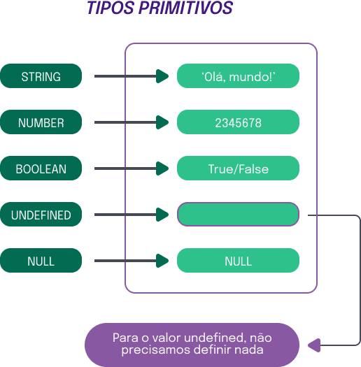

# Tipos primitivos
  
  ## O que vamos aprender?

  - Antes de continuarmos avançando com os aprendizados em JavaScript, lembre-se de que você já é capaz de:

    * Definir o que é uma variável e que variáveis podem guardar valores;
    * Saber que tipos diferentes de valores podem ser guardado em variáveis;

    ### Você será capaz de:

      - Definir o que são tipos primitivos;
      - Definir o que são tipos primitivos e quais são eles no JavaScript;
      - Escrever código em JavaScript utilizando variáveis, constantes e tipos primitivos.

  ## Por que isso é importante?

    - Assim como em qualquer linguagem de programação, o JavaScript lida com números, frases e outros tipos de valores que representam elementos da vida real, como, por exemplo, a idade e o nome de uma pessoa.

    - Para implementar códigos, é fundamental conhecer os tipos de dados que estão disponíveis e como trabalhar com cada um deles.

    ### Tipos Primitivos no JavaScript

      - Ao utilizar computação para resolver problemas, é necessário representar informações da vida real, como números e textos. É para isso que os tipos primitivos servem, para que você consiga representar algo do mundo real em formato de código.

      - Em JavaScript, os tipos primitivos que você mais irá encontrar são os seguintes:

        * `string`: sequências de caracteres, como palavras, textos, senhas, etc.;
        * `number`: números, podendo ser positivos ou negativos, inteiros ou decimais;
        * `boolean`: pode ser representado apenas pelos valores verdadeiro (`true`) ou falso (`false`).

      - Veja alguns exemplos de dados desses tipos em código JavaScript:

        ~~~javascript
          let nome = 'Tryber'; // string
          let idade = 19; // number
          let aprovado = true; // boolean
        ~~~

      - Existem também alguns tipos que representam dados que possuem valores nulos ou valores indefinidos:

        * `null`: é um valor atribuído como nulo, ou seja, é um valor vazio;
        * `undefined`: não possui um valor, ou seja, é um dado que não foi definido.

    ### Testando o tipo de uma variável

      - Existe um operador no JavaScript chamado `typeof`, que identifica o tipo de uma variável!

      - Olha só esses exemplos:

        ~~~javascript
        let nome = 'Tryber';
        let idade = 19;
        let aprovado = true;

        console.log(typeof nome); // string
        console.log(typeof idade); // number
        console.log(typeof aprovado); // boolean
        ~~~

      - Viu só? Ao usarmos o operador `typeof` antes do nome de uma variável, o seu tipo é retornado.

    ### Tipo primitivo `string`

      - Valores do tipo string são sequências de caracteres, escritos entre aspas simples (‘) ou duplas (“). Podem ser palavras, frases, textos inteiros, etc.

        ~~~javascript
          const login = 'Tryber';
          const senha = 'gKa!x!VJyJxzW5tku&iHp';
          const cpf = '1234567890';
        ~~~

      > __Dica__: _Qualquer valor será do tipo `string` se for escrito entre aspas._

    ### Tipo primitivo number
    
      - Em JavaScript, o tipo `number` pode representar duas categorias de números:

        * números inteiros, como `3`;
        * números decimais, como `5.5`.

      - Observe o exemplo:

        ~~~javascript
          let numero = 42;
          const pi = 3.14159265359;

          console.log(typeof numero); // number
          console.log(typesof pi); // number
        ~~~

      > __Dica__: _O separador decimal usado em linguagens de programação é o ponto, e não a vírgula._

    ### Tipo primitivo `boolean`

      - O tipo `boolean`, ou booleano em português, é um tipo que só pode assumir os valores verdadeiro ou falso. No contexto do JavaScript, o valor verdadeiro é `true`, e falso é `false`.

        ~~~javascript
            let cadastroAtivo = true;
            let habilitado = false;
        ~~~

    ### Tipo primitivo `null`
      - Em certas situações, precisamos lidar no código com variáveis que ainda não sabemos o valor que ela vai receber. Para isso, existe o valor `null`, que faz com que a variável tenha um valor nulo.

      ~~~javascript
        let valorNulo = null;
      ~~~
    ### Tipo primitivo `undefined`
  
      - O tipo `undefined` é atribuído pelo JavaScript a variáveis que não possuem um valor ou que não foram declaradas, ou seja, são indefinidas. Veja o exemplo abaixo:

        ~~~javascript
          let variavelSemValor;
          console.log(typeof variavelSemValor); // undefined
          console.log(typeof variavelNaoDeclarada); // undefined
        ~~~

      - A variável `variavelSemValor` foi declarada sem atribuição de valor e a `variavelNaoDeclarada` nunca foi declarada. Nos dois casos, a resposta exibida no console é `undefined`.

      - De modo geral, não é desejável que haja variáveis desse tipo em um código. Normalmente, elas indicam que houve algum erro.

      - Nos casos em que uma variável precisa ter seu valor vazio, a melhor prática é atribuir a ela o valor `null`.

      

          
        

  
  ## Exercícios

    ### Crie variáveis de diferentes tipos

      - Declare uma variável com o nome:

        * `tipoTexto` e atribua a ela um valor do tipo `string`;
        * `tipoNumero` e atribua a ela um valor do tipo `number`;
        * `verdadeiro` e atribua a ela um valor do tipo `boolean` correspondente ao nome;
        * `falso` e atribua a ela um valor do tipo `boolean` correspondente ao nome;
        * `tipoNulo` com o valor `null`;
        * `tipoIndefinido` e sem valor.

        ~~~javascript
          let tipoTexto = 'Texto';
          let tipoNumero = 12;
          let verdadeiro = true; 
          let falso = false;
          let tipoNulo = null;
          let tipoIndefinido
        ~~~
      
    ### Corrija os valores
      - No código abaixo, os valores das variáveis estão trocados. Faça com que cada variável possua seu valor correto sem atribuir nenhum valor novo além dos que já estão no código.

      ~~~javascript
        let nome = true;
        let idade = 'Harry Potter';
        let souUmBruxo = 210;
      ~~~

      - Correção
      ~~~javascript
        let souUmBruxo = true;
        let nome = 'Harry Potter';
        let idade = 210;
      ~~~
