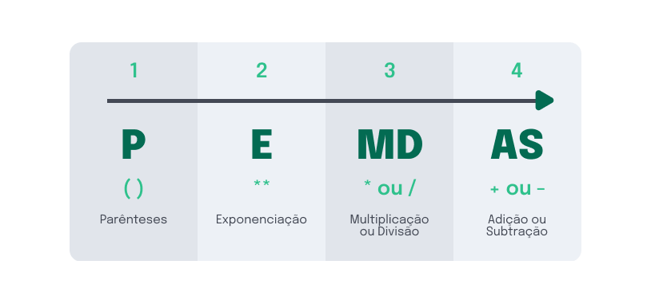

# Operadores Aritméticos
  
  ## O que vamos aprender?
  - Nesta lição vamos começar a explorar o poder dos operadores e das operações aritméticas para desenvolver lógicas e solucionar problemas usando JavaScript.

    ### Seremos capaz de:
      - Utilizar os operadores aritméticos;
      - Alterar o valor de uma variável com base nas operações clássicas da matemática.

    ### Por que isso é importante?
      - Pois para trabalhar com desenvolvimento é necessário ter um dom na matemática e dominar todas as operações possíveis? Não é bem assim!

      - Um alienígena programador pode desenvolver lógicas inteiras sabendo apenas o fundamental da matemática, ou até mesmo não sabendo nada! Mesmo assim, devemos ter em mente que essa tão amada área do conhecimento tem grande importância para a programação.

      - Na programação, os operadores aritméticos são essenciais para que seja possível realizar operações para manipular dados com o objetivo de chegar ao resultado final desejado.

  ## Operações Aritméticas no JavaScript
    - Em JavaScript, a matemática não é muito diferente da dos livros. Operações, como adição ou subtração, são casualmente usadas para desenvolver algoritmos capazes de manipular valores, sejam eles números ou não.

    - Observe como podemos usar as quatro operações fundamentais (soma, subtração, multiplicação e divisão) em JavaScript:

    > __Dica__: _Use o console do navegador para praticar essas operações e analisar o que é retornado._

    ~~~javascript
      // Operação de soma:
      2 + 2; // 4

      // Operação de subtração:
      10 - 2; // 8

      // Operação de multiplicação:
      4 * 3; // 12

      // Operação de divisão:
      12 / 6; // 2
    ~~~
    
    - Os símbolos (`+`, `-`, `*`, e `/`) são o que chamamos de operadores aritméticos. Eles são utilizados para fazer operações com dois valores e produzir um novo valor único.

    - Então não é possível fazer operações com mais de dois valores?

      * Sim! É possível! Na programação, assim como na matemática, operações como `2 + 2 - 2 * 4 / 2` existem, e para que a operação retorne o resultado correto utilizamos o conceito de “ordem de precedência”, ou seja, calcula-se primeiro a multiplicação e a divisão, depois a soma e a subtração.

    - E se precisarmos calcular primeiro a operação de soma e de subtração para só depois calcular a operação de multiplicação e de divisão?

      - Para isso, podemos definir uma operação como prioridade usando os parênteses `()`. Dessa forma, pode-se mudar a operação para `(2 + 2 - 2) * 4 / 2`. Nesse caso, as operações de dentro dos parênteses (soma e subtração) serão calculadas primeiro, e só então o resultado é multiplicado por 4 e dividido por 2.

    - Dependendo dos operadores presentes em uma operação e do posicionamento deles, é possível chegar a diferentes resultados. Por exemplo:

      ~~~javascript
        (2 + 2 - 2) * 4 / 2 // Retorna 4

        (2 + 2 - 2) / 4 * 2 // Retorna 1
      ~~~

    > __Dica__: _na matemática existe um macete para saber a ordem de precedência das operações, o famoso ‘PEMDAS’:_

    

      
    

    > __Obs__: _se a multiplicação e a divisão, ou a soma e a subtração, estiverem na mesma operação, deve-se calcular da esquerda para a direita._

    - Outro operador que pode ser utilizado em JavaScript é o `**`, responsável por realizar operações de exponenciação. A exponenciação (ou potenciação) ocorre quando um dado número é multiplicado por ele mesmo, uma quantidade `n` de vezes. Por exemplo:

      ~~~py      
        2² = 2 x 2 = 4
        4³ = 4 x 4 x 4 = 64
      ~~~

      - Em JavaScript:

      ~~~javascript      
        2 ** 2 // Retorna 4
        4 ** 3 // Retorna 64
      ~~~

      - Viu só como podemos usar o poder dos operadores aritméticos para resolver operações matemáticas em JavaScript? Calma que ainda falta você conhecer mais um operador: o operador de módulo.

    ### Operações de módulo
      
      - A operação de módulo encontra o resto da divisão de um número por outro. É possível encontrar o módulo de uma divisão usando o operador de porcentagem (`%`). Por exemplo, o módulo de 4 divido por 2 é 0 `(4 % 2 = 0)`, já o módulo de 4 divido por 3 é 1 `(4 % 3 = 1)`.

        * Em JavaScript:

        ~~~javascript
          2 % 2 // Retorna 0
          7 % 3 // Retorna 1
          5 % 3 // Retorna 2
        ~~~

      - Agora que você aprendeu sobre os operadores aritméticos, está na hora de realizar operações usando variáveis para salvar e modificar valores. Continue com foco nos estudos!

    ### Usando Operações Aritméticas para alterar valores no JavaScript
    
      - Em qualquer algoritmo que envolva manipulação de dados, provavelmente haverá uma operação aritmética, mesmo que esses dados não sejam numéricos. Uma `operação aritmética` é toda ação que manipula e modifica valores usando os `operadores aritméticos`.

      - Quando uma operação é realizada, o valor retornado por essa operação geralmente é armazenado em uma variável para que possa ser usada em alguma lógica do código. Por exemplo, no código abaixo, o valor retornado pela operação de soma é salvo na variável `soma`. Assim, o valor da variável pode ser usado em qualquer lugar, basta chamar ela:

      ~~~javascript
        // Criando a Varável 'soma'  
        let soma = 10 + 5;
        console.log(soma); // Mostra o valor 15 no console
      ~~~

      - Valores salvos em variáveis também podem ser usados para fazer outras operações:

      ~~~javascript  
        let primeiroExemplo = 2 + 5 + 8;
        console.log(primeiroExemplo); // 15

        let segundoExemplo = 8 + 3 * 4;
        console.log(segundoExemplo); // 20

        let terceiroExemplo = (4 + 5 - 3) / 2;
        console.log(terceiroExemplo ); // 3

        let quartoExemplo = 2 ** 3;
        console.log(quartoExemplo); // 8

        let quintoExemplo = 10 % 7;
        console.log(quintoExemplo); // 3

        let meuUltimoExemplo = primeiroExemplo + segundoExemplo * (terceiroExemplo / quintoExemplo) - quartoExemplo;
        console.log(meuUltimoExemplo ); // 27
      ~~~

      - Em JavaScript, é possível realizar operações com outros tipos de valores, como, por exemplo, `strings` e `booleans`:

      ~~~javascript
        let hello = 'Hello';
        hello = hello + ' ' + 'World';

        console.log(hello); // "Hello World"

        let somaBoolean = true + true;
        console.log(somaBoolean); // 2
      ~~~

  ## Exercícios

  ### Realize a soma
    - O objetivo deste exercício é realizar a soma entre 178 e 93. Para isso:

      * Crie a variável `primeiroNumero` e atribua a ela o valor `178`;
      * Crie a variável `segundoNumero` e atribua a ela o valor `93`;
      * Crie a variável `resultadoDaSoma` e atribua a ela a soma entre as variáveis `primeiroNumero` e `segundoNumero`.

      ~~~javascript
        let firstNumber = 178
        let secondNumber = 93
        let result = firstNumber + secondNumber
        console.log(result)
      ~~~
  
  ### Subtraindo números
    - O objetivo deste exercício é realizar a `subtração entre 133 e 87`. Para isso:

      * Crie a variável `primeiroNumero` e atribua a ela o valor `133`;
      * Crie a variável `segundoNumero` e atribua a ela o valor `87`;
      * Crie a variável `resultadoDaSubtracao` e atribua a ela a subtração entre as variáveis `primeiroNumero` e `segundoNumero`.

      ~~~javascript
        let primeiroNumero = 133
        let segundoNumero = 87
        let resultadoDaSubtracao = primeiroNumero - segundoNumero
        console.log(resultadoDaSubtracao)
      ~~~
  
  ### Divida os números
    - O objetivo deste exercício é realizar a `divisão de 192 por 12`. Para isso:

      * Crie a variável `dividendo` e atribua a ela o valor `192`;
      * Crie a variável `divisor` e atribua a ela o valor `12`;
      * Crie a variável `resultadoDaDivisao` e atribua a ela a divisão da variável `dividendo` pela variável `divisor`.

      ~~~javascript
      let dividendo = 192
      let divisor = 12
      let resultadoDaDivisao = dividendo / divisor
      console.log(resultadoDaDivisao)
      ~~~
  
  ### Multiplicando os números
    - O objetivo deste exercício é realizar a `multiplicação de 133 por 13`. Para isso:

      * Crie a variável `multiplicador` e atribua a ela o valor `133`;
      * Crie a variável `multiplicando` e atribua a ela o valor `13`;
      * Crie a variável `resultadoDaMultiplicacao` e atribua a ela a multiplicação da variável `multiplicador` pela variável `multiplicando`.

      ~~~javascript
        let multiplicador = 133
        let multiplicando = 13
        let resultadoDaMultiplicacao = multiplicador * multiplicando
        console.log(resultadoDaMultiplicacao)
      ~~~
  
  ### Realize a potência 🔢
    - O objetivo deste exercício é encontrar o resultado da `potência de base 2 e expoente 10`. Para isso:

      * Crie a variável `base` e atribua a ela o valor `2`;
      * Crie a variável `expoente` e atribua a ela o valor `10`;
      * Crie a variável `potencia` e atribua a ela a operação da variável `base` elevada a variável `expoente`.

      ~~~javascript
        let base = 2
        let expoente = 10
        let potencia = base ** expoente
        console.log(potencia)
      ~~~

  ### Resto da divisão
    - O objetivo deste exercício é encontrar o `resto da divisão de 11 por 3`. Para isso:

      * Crie a variável `dividendo` e atribua a ela o valor `11`;
      * Crie a variável `divisor` e atribua a ela o valor `3`;
      * Crie a variável `restoDaDivisao` e atribua a ela a o resto da divisão entre a variável `dividendo` pela variável `divisor`.

      ~~~javascript
        let dividendo = 11
        let divisor = 3
        let restoDaDivisao = dividendo % divisor
        console.log(restoDaDivisao)
      ~~~