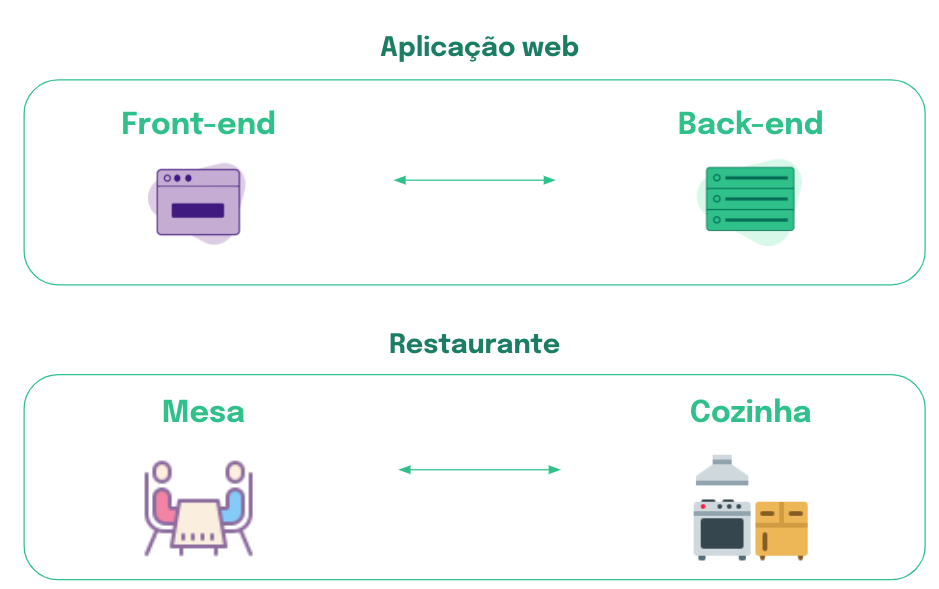

# Javascript - história e potencial dessa linguagem

### O que vamos aprender?
- Você vai aprender o que é _JavaScript_, conhecer um pouco da história dessa linguagem e entender por que ela é fundamental no desenvolvimento web.

- Você vai compreender também como a prática da programação pode enriquecer sua capacidade de desenvolver o raciocínio lógico, te ajudando a simplificar tarefas do dia a dia. Ela estimula a sua criatividade e perseverança, contribuindo também para gerar novas ideias e colocá-las em prática!

### Você será capaz de:
* Identificar o que é e para que serve a programação;
* Conhecer a história do JavaScript e entender o potencial dessa linguagem para o desenvolvimento web.

## Por que isso é importante?
- Uma das áreas do mercado de TI que mais gera oportunidades é o desenvolvimento web, por utilizar ferramentas e linguagens relativamente amigáveis. Uma delas é o JavaScript, que é uma das linguagens mais populares do mundo e, além de ser utilizada em vários softwares e até aplicativos mobile, permite que páginas em toda a web tenham comportamentos dinâmicos! Sabe quando a página de notícias atualiza sozinha após algum tempo? Então! Isso é um comportamento dinâmico.

- É muito importante conhecer o contexto histórico e o potencial dessa linguagem, já que você vai utilizá-la com frequência no desenvolvimento web!
***

## O que significa programar?
- Quando você está navegando em um site na internet, você provavelmente clica em botões que te permitem interagir com a página: levam você para outra página, abrem uma janela, um formulário, além de outras tantas interações. Para que cada ação dessas aconteça, existem instruções que foram escritas, o que faz com que o computador se comporte dessa maneira.

- Imagine que você preencheu um formulário em um site. Para que as informações cheguem corretamente, conforme o esperado, foi necessário que pessoas programadoras enviassem instruções passo a passo do que o computador deveria fazer no momento em que o botão “Enviar” fosse clicado. Por exemplo:

    * Verifique se os campos obrigatórios foram preenchidos;
    * Envie as informações preenchidas para um endereço de e-mail após o clique do botão;
    * Carregue uma mensagem avisando que o formulário foi enviado com sucesso;
    * Envie um e-mail para a pessoa comunicando que suas informações foram recebidas.

- Existem atualmente diversas linguagens para escrevermos instruções para os computadores: são as linguagens de programação, que se comunicam com o computador por meio de um código que máquina e humanos conseguem interpretar, formando o que chamamos de programas.

- Programar é isso: dar ordens para que os computadores façam o que você quer que eles façam, de forma bem detalhada. Uma das linguagens que permitem escrever programas é o JavaScript, uma das mais predominantes no mercado.

### JavaScript: uma das linguagens mais importantes no desenvolvimento de aplicações web
- O JavaScript foi criado em 1995, por Brendan Eich, com o objetivo de deixar as páginas da web mais interativas e dinâmicas, pois até então elas só apresentavam conteúdo estático. Sua criação foi um sucesso, e a linguagem efetivamente transformou a forma como usamos a web.

- Hoje, todos os navegadores têm suporte ao JavaScript e ele é o principal responsável pelas interações de pessoas usuárias com aplicações disponíveis na web.

### O papel do JavaScript no Desenvolvimento Web
- Ao acessar uma página, você pode ver e interagir com diversos conteúdos, desde o botão play do YouTube até este texto que você está lendo agora. Todo código responsável por exibir algum conteúdo na tela do seu computador ou celular e que permita que você interaja com ele faz parte do que chamamos de front-end.

- Para que uma página web funcione, é preciso ter recursos e dados para serem exibidos. Para isso, o back-end entra em ação: é ele que recebe as solicitações vindas do front-end, busca essas informações onde estiverem armazenadas e as devolve para serem exibidas na tela.

- Imagine que você está em um restaurante e faz o pedido para o garçom, que leva seu pedido até a cozinha. A cozinha prepara a sua refeição e o garçom traz para você. Nesse caso, o garçom é o front-end. A cozinha, que recebe seu pedido, prepara e informa o garçom para entregar para você, é o back-end. Observe a imagem abaixo, que representa esse fluxo:

<h1 align="center">
  
</h1>